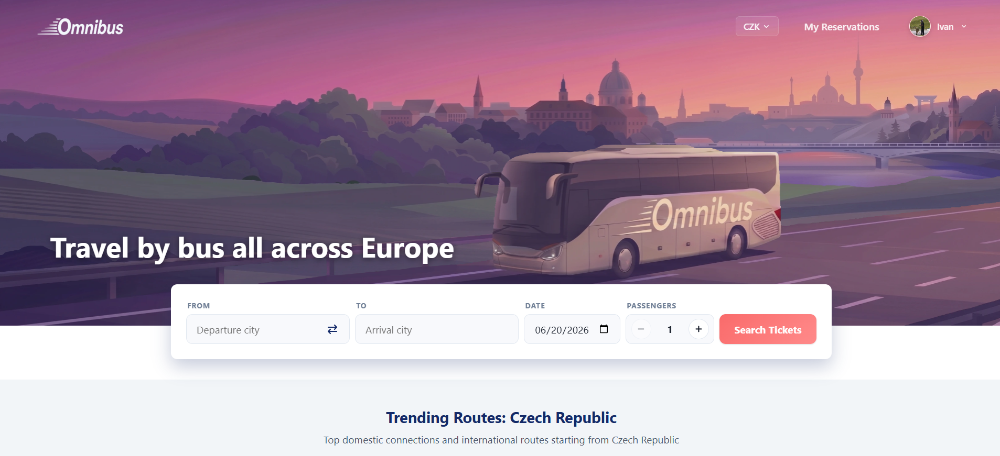

# Omnibus — Enterprise Bus Transportation System

## Live Demo

The application is deployed and available at:
[omnibus-frontend.vercel.app](https://omnibus-frontend.vercel.app/)

A demo user is available for testing:
- **Email:** `john.sullivan@kaj.omnibus.example.com`
- **Password:** `e[MQhlvU+[9o6Qxv`



---

## Table of Contents
1. [Live Demo](#live-demo)
2. [Table of Contents](#table-of-contents)
3. [Project Goal and Motivation](#project-goal-and-motivation)
4. [Technology Stack](#technology-stack)
5. [Project Structure](#project-structure)
6. [Getting Started and Local Development](#getting-started-and-local-development)
7. [Frontend Client Flow (Functional Description)](#frontend-client-flow-functional-description)
8. [Key Backend Features](#key-backend-features)
9. [Security](#security)
10. [System Roles](#system-roles)
11. [API Endpoints](#api-endpoints)
12. [Testing](#testing)
13. [Layered Architecture of Backend Core](#layered-architecture-of-backend-core)
14. [Incoming Architecture Change](#incoming-architecture-change)
15. [Screenshots](#screenshots)
16. [Authors](#authors)

---

## Project Goal and Motivation

The goal of this semester project is to **design and implement an enterprise information system** for a bus transportation company (inspired by FlixBus). 

This project is built around a live, complex search and booking algorithm for trip segments (resolving routes, trips, reservations, and passenger manifests on the backend). The frontend was developed to serve as a premium presentation layer, communicating directly with the live Java Spring Boot server and PostgreSQL database, utilizing zero local mock data. 

---

## Technology Stack

### Backend
| Technology | Version | Purpose |
|---|---|---|
| **Java** | 21 | Core language |
| **Spring Boot** | 3.5.6 | Application framework |
| **Spring Security** | 6.x | JWT authentication & authorization |
| **JPA / Hibernate** | 6.6 | ORM with native PostgreSQL enum support |
| **PostgreSQL** | 15 | Primary database |
| **Flyway** | 11.x | Database migrations (prepared) |
| **Lombok** | 1.18 | Boilerplate reduction |
| **JUnit 5 + Mockito** | 5.12 | Unit testing |
| **Testcontainers** | 1.21 | Integration tests with real PostgreSQL |

### Frontend
| Technology | Version | Purpose |
|---|---|---|
| **React** | 19.x | UI framework |
| **TypeScript** | 5.9 | Type safety |
| **Vite** | 7.x | Build tooling & dev server |
| **React Router** | 7.x | Client-side routing |
| **Axios** | — | HTTP client |

---

## Project Structure

```
Omnibus-frontend/
├── src/main/java/cz/cvut/ear/bus2holiday/
│   ├── config/              # Security, CORS, JWT filter configuration
│   ├── controller/          # REST controllers
│   ├── dao/                 # JPA repositories (Spring Data)
│   ├── dto/
│   │   ├── mapper/          # Entity ↔ DTO mapping
│   │   ├── request/         # Inbound request DTOs
│   │   └── response/        # Outbound response DTOs
│   ├── exception/           # Global exception handling (GlobalExceptionHandler)
│   ├── model/               # JPA entities (Reservation, ReservationPassenger, Terminal...)
│   │   └── enums/           # Enumerations (UserRole, TripStatus, BusStatus, ...)
│   ├── security/            # JWT provider, SecurityUtils, UserDetailsService
│   ├── service/             # Business logic layer
│   └── utils/               # Utility helpers
├── src/main/resources/
│   ├── application.properties    # Main configuration
│   └── data.sql                  # Initial seed data (runs on startup)
├── src/test/                     # Backend tests
│   ├── java/.../                 # Integration & unit tests (Testcontainers)
│   └── resources/                # Test-specific properties
├── frontend/                     # React Single Page Application (SPA)
│   ├── src/
│   │   ├── api/                  # Axios API client & endpoints
│   │   ├── assets/               # Static media assets (logos, fleet walkaround video, screenshots)
│   │   ├── components/           # UI Components
│   │   │   ├── common/           # Button, Card, Input, OfflineAlert, ParallaxBanner, SearchPanel
│   │   │   └── layout/           # Header, Footer
│   │   ├── context/              # React Context stores (AuthContext, CurrencyContext)
│   │   ├── pages/                # Application pages (HomePage, SearchPage, TripDetailsPage...)
│   │   ├── utils/                # Geolocation, OOP patterns, helper utilities
│   │   ├── App.tsx               # App routing and layout wrap
│   │   ├── index.css             # Main CSS variables and styling overrides
│   │   └── main.tsx              # React client DOM entry point
│   ├── vite.config.ts            # Vite compiler configuration
│   └── package.json              # Frontend dependencies and run scripts
├── docker-compose.yml            # Container definitions for PostgreSQL & backend
├── Dockerfile                    # Backend Docker build instructions
└── pom.xml                       # Maven build descriptor
```

---

## Getting Started and Local Development

### Prerequisites
- **Java 21+**
- **Node.js 18+**
- **Docker** (recommended) or a local PostgreSQL 15 instance

---

### Option A — Docker Compose (Recommended)

Starts PostgreSQL + the Spring Boot app in one command:

```bash
docker-compose up --build
# Backend: http://localhost:8080
```

---

### Option B — Local Development Setup

#### 1. Database Setup

Create a local PostgreSQL database:
```sql
CREATE DATABASE bus2holiday;
```

#### 2. Backend Config & Run

Configure `src/main/resources/application.properties`:
```properties
spring.datasource.url=jdbc:postgresql://localhost:5432/bus2holiday
spring.datasource.username=YOUR_USER
spring.datasource.password=YOUR_PASSWORD
jwt.secret=YOUR_SECRET_KEY_MIN_32_CHARS
```

Then run:
```bash
./mvnw spring-boot:run
# Backend: http://localhost:8081
```

On first startup, Hibernate auto-creates all tables and enum types, then `data.sql` seeds the initial data.

**Default seed accounts** (from `data.sql`):
| Email | Password | Role |
|---|---|---|
| `admin@bus2holiday.com` | `password` | Admin |
| `john@example.com` | `password` | User |
| `driver@example.com` | `password` | Driver |

#### 3. Frontend Setup & Run

```bash
cd frontend
npm install
npm run dev
# Frontend: http://localhost:5173
```

---

### Option C — Production Deployment (Vercel & Railway)

The application is deployed live using a hybrid cloud setup:
- **Frontend client:** Hosted on **Vercel** ([omnibus-frontend.vercel.app](https://omnibus-frontend.vercel.app/)).
- **Backend & Database:** Hosted on **Railway** (Spring Boot + PostgreSQL).

#### 1. Backend & Database (Railway)
1. **Create a project** on Railway and provision a **PostgreSQL** database service.
2. **Deploy the backend** by linking the repository. Railway will detect the `Dockerfile` at the root and deploy the Java Spring Boot service.
3. Configure the following environment variables in the Railway service:
   - `PORT`: Configured dynamically by Railway (typically maps to `8080` internally).
   - `SPRING_DATASOURCE_URL`: Automatic connection string injection (e.g., `jdbc:postgresql://<host>:<port>/<dbname>`).
   - `SPRING_DATASOURCE_USERNAME` / `SPRING_DATASOURCE_PASSWORD`: Database credentials.
   - `JWT_SECRET` / `jwt.secret`: A minimum 32-character secret key for JWT signature validation.

#### 2. Frontend Client (Vercel)
1. **Deploy a new project** on Vercel, targeting the `frontend` subdirectory of the repository.
2. Set the build directory options:
   - **Framework Preset:** Vite
   - **Build Command:** `npm run build`
   - **Output Directory:** `dist`
3. Configure the following environment variable:
   - `VITE_API_BASE_URL`: Set to the public URL of your Railway backend service (e.g., `https://omnibus-frontend-production.up.railway.app/api`).

---


## Frontend Client Flow (Functional Description)

### Registration, Geolocation, and Personalization
- **Registration Profile Upload:** During registration, users can upload an avatar image, which supports drag-and-drop actions or standard file dialog selection (implemented via HTML5 File API).
- **Geolocation API Integration:** In the registration form, users can select a country, or click a button to query their physical location automatically using the browser's native Geolocation API. If the returned country is unsupported, a fallback option is selected, and a notice is displayed: *"Your country is not on our list, we do not operate there"*.
- **Country-based Personalization:** The user's country drives homepage trip recommendations, search autocompletes, and defines the default currency. Unregistered guests or users from unsupported countries receive default placeholders.
- **Profile Updates:** The user profile page allows modifying details (avatar, country, names, and phone number, excluding the email address). Toast notifications indicate a successful update *only* if the form data has actually changed compared to the database.

### Homepage, Parallax Banner, and Deferred Media
- **Interactive Parallax Banner:** The homepage banner contains 4 custom-sliced parallax graphic layers moving along trajectories defined by Lissajous curves (elliptical orbits using sine/cosine). Page Visibility API freezes the WebGL canvas animation when the browser tab is inactive to conserve system memory. Because of layer rendering combined with a CSS gradient, the animation takes a brief moment to initialize upon page load.
- **Deferred Video Player:** The fleet walkaround video utilizes a deferred preloader (hooked into window loading), showing the first video frame as a static preview image. The player controls are split: a custom play/pause overlay click area handles actions via JavaScript, while standard HTML5 player controls remain in the passive video area.

### Search Panel, Autocomplete, and Caching
- **Autocomplete suggestions:** Terminal fields show auto-suggestions after typing 2 characters, querying the terminal database.
- **LocalStorage Caching with TTL:** The list of terminals is cached in the browser's `localStorage` with a 24-hour Time-to-Live (TTL) expiration check.
- **Smart suggestions:** Typing a country lists all of its cities and terminals. A city may contain multiple terminals, and users can choose either a city or a specific terminal.
- **Search boundaries:** The trip date search is limited to 3 months forward from the current date (e.g. searching from June allows trips up to the end of September). Passenger inputs are bounded between 1 and 10.
- **Promo Cards:** Homepage popular trip cards and promo discount banners pre-populate the search panel fields when clicked.

### Authentication & Route Authorization
- **Search Availability for Guests:** Unauthenticated users can search and view trip results but must log in or sign up to proceed to checkout.
- **Context-Aware Redirects:** Logging in during a booking flow redirects users back to their active search results. Logging out preserves the current page if public, or redirects to the login screen if the current page requires authentication.
- **Dynamic Header Elements:** The header authentication button toggles between "Sign In" and "Sign Up" dynamically by checking the login state stored in `localStorage`.

### Booking Process, Live Seat Mapping, and Payment Simulation
- **Pre-filled Booking Details:** The booking page pre-fills trip parameters and displays the logged-in user's contact info (immutable email and phone).
- **Dynamic Passenger Inputs:** Booking forms generate passenger details matching the searched passenger count. The first passenger's details are pre-filled with user info and remain editable.
- **Live SVG Seat Map:** Renders an interactive SVG seat layout showing occupied, vacant, and premium seats. Seat configurations (including panoramic seating) are loaded dynamically from a JSON layout mapped to `Bus.seat_layout` from the database. Toast notifications are shown for selections.
- **Dynamic Checkout Pricing:** Booking costs, fees, and surcharges update in real-time in the checkout sidebar card. Incomplete fields or unselected seats prevent moving to payment, auto-scrolling to the missing inputs.
- **Payment Simulation:** The payment screen features a 15-second simulation timer with an option to skip the countdown, which redirects the user to the Reservations page.
- **Session Navigation & Seat Hold Cancellation:** Clicking "Back" in the browser during checkout cancels the reservation hold in the database and returns to the pre-filled booking screen. Clicking "Back" after completing payment and being redirected returns the user directly to the search results (retaining search query parameters), bypassing checkout screens.

### My Reservations & Boarding Pass
- **Reservation lists:** The page shows upcoming and past bookings in `CONFIRMED`, `EXPIRED`, or `COMPLETED` statuses. Un-boarded trips automatically expire.
- **Ticket Cancellation:** Active upcoming bookings can be cancelled, instantly releasing the reserved seats back into the database.
- **Printable Boarding Pass:** "Show Ticket" opens a printable boarding pass detailing terminals, platforms, times, driver name, vehicle model/license plate, passenger seat details, and unique passenger QR codes (encoding booking reference, seat number, and passenger name).

### Layout Responsiveness
- All pages adapt to various screens (e.g., vertical search layout, headers collapsing into dropdown avatar menus, grid cards reorganizing on mobile).

---

## Key Backend Features

### Live Search & Seat Booking Logic (NSS/EAR)
- **Real-Time Segment Availability:** Searches perform live, un-cached queries across routes (`Route`), trips (`Trip`), and bookings. Calculates segment-level vacancy by evaluating `Reservation` and `ReservationPassenger` entities (replacing obsolete BookedSegments).
- **Dynamic Surcharges:**Surcharges are calculated dynamically based on time of day, international borders, and premium panoramic seats.
- **Pre-Generated Routes & Occupancy:** The database contains 53 pre-generated routes across Europe with regular schedules for six months and millions of pre-loaded segment bookings. Occupancy ranges from 25% for trips 6 months out to 80% for current-week trips.
- **Immediate Currency Updates:** Changing the preferred currency in the header immediately updates the database (`preferred_currency` column on User) and recalculates all prices site-wide.
- **Pessimistic locking:** Prevents double-booking under concurrent load by holding locks during booking.

---

## Security

- **JWT tokens** — stateless authentication, 24h expiration
- **RBAC** — `user`, `driver`, `admin` roles via `@PreAuthorize`
- **Method-level security** on all controllers
- **CORS** — configured for `http://localhost:*` and Vercel domains
- **Input validation** — `@Valid` + Bean Validation on all request DTOs
- **Centralized exception handling** — `GlobalExceptionHandler` with consistent error responses

---

## System Roles

| Role | Description |
|---|---|
| **Admin** | Full access. Manages users, roles, routes, buses, drivers, and reservations. |
| **User** | Searches trips, creates and cancels reservations, pays for tickets. |
| **Driver** | Views assigned trips, manages own availability. |

---

## API Endpoints

### Public (no authentication required)
| Method | Endpoint | Description |
|---|---|---|
| `POST` | `/api/auth/login` | Login, returns JWT |
| `POST` | `/api/auth/register` | New user registration |
| `GET` | `/api/trips/search` | Search trips by criteria |
| `GET` | `/api/trips/{id}` | Trip details |
| `GET` | `/api/trips/{id}/available-seats` | Available seats for a trip |
| `GET` | `/api/routes` | All routes |
| `GET` | `/api/routes/{id}` | Route details with stops |
| `GET` | `/api/terminals` | Retrieve all terminals |

### Authenticated (any role)
| Method | Endpoint | Description |
|---|---|---|
| `GET` | `/api/users/me` | My profile |
| `PUT` | `/api/users/{id}` | Update my profile |
| `GET` | `/api/reservations` | My reservations |
| `POST` | `/api/reservations` | Create a reservation |
| `DELETE` | `/api/reservations/{id}` | Cancel a reservation |
| `POST` | `/api/reservations/{id}/pay` | Pay for a reservation |
| `GET` | `/api/drivers/me/trips` | My trips (driver only) |

### Admin only
| Method | Endpoint | Description |
|---|---|---|
| `GET/POST` | `/api/buses` | List / create buses |
| `GET/PATCH/DELETE` | `/api/buses/{id}` | Get / update status / delete bus |
| `GET/POST` | `/api/routes` | List / create routes |
| `POST/DELETE` | `/api/routes/{id}/stops` | Add / remove route stops |
| `POST/PUT/DELETE` | `/api/trips` | Manage trips |
| `GET/POST/DELETE` | `/api/drivers` | Manage drivers |
| `GET/DELETE` | `/api/users` | List / delete users |

---

## Testing

```bash
# Run all tests (requires Docker for Testcontainers)
./mvnw test
```

### Test Infrastructure
- **Testcontainers** — each test suite spins up an isolated PostgreSQL 15 container
- `TestContainerConfig` — shared abstract base class with a single static container instance
- `ddl-auto=create-drop` in test profile — clean schema on every context load
- `preparedStatementCacheQueries=0` — prevents PostgreSQL cached plan errors across contexts
- **`@Transactional`** on all test classes — automatic rollback after each test

### Test Coverage
| Type | Framework | Location |
|---|---|---|
| Unit tests | JUnit 5 + Mockito | `service/` |
| Repository tests | `@Transactional` + EntityManager | `dao/` |
| Controller tests | MockMvc + Testcontainers | `controller/` |
| Service integration | Full Spring context | `service/` |

---

## Layered Architecture of Backend Core

```
┌─────────────┐     ┌───────────────┐     ┌─────────────┐     ┌──────────────┐
│  Frontend   │---->│  Controller   │---->│   Service   │---->│  Repository  │
│  (React)    │<----│  (REST API)   │<----│  (Business) │<----│   (JPA)      │
└─────────────┘     └───────────────┘     └─────────────┘     └──────────────┘
                           │                                         │
                    ┌──────┴──────┐                           ┌──────┴──────┐
                    │  DTO/Mapper │                           │ PostgreSQL  │
                    └─────────────┘                           └─────────────┘
```

- **Controllers** accept and return **DTOs only** — no JPA entities exposed to the API layer
- **Mappers** handle entity ↔ DTO conversion (`UserMapper`, `BusMapper`, `TripMapper`, `ReservationMapper`, etc.)
- **Services** contain all business logic and enforce transactional boundaries
- **Repositories** use Spring Data JPA with custom JPQL queries where needed

---

## Incoming Architecture Change


---

## Screenshots

Below are screenshots showcasing the interface and workflows of the Omnibus client application.


---

## Authors

**Ivan Shestachenko, Mykhailo Plokhin, 2026, B6B36EAR, B6B36NSS, B0B39KAJ @ FEE CTU**
