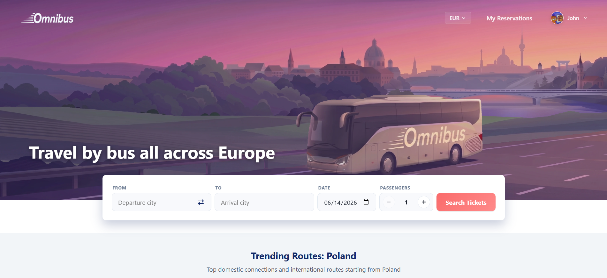
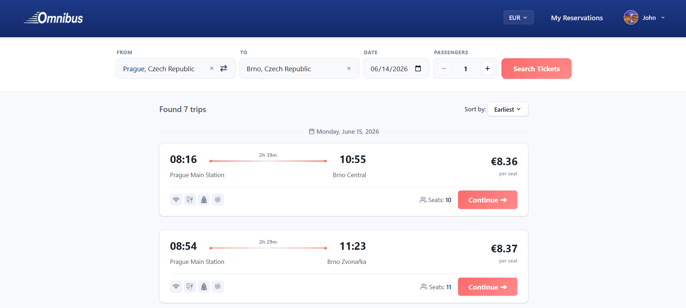
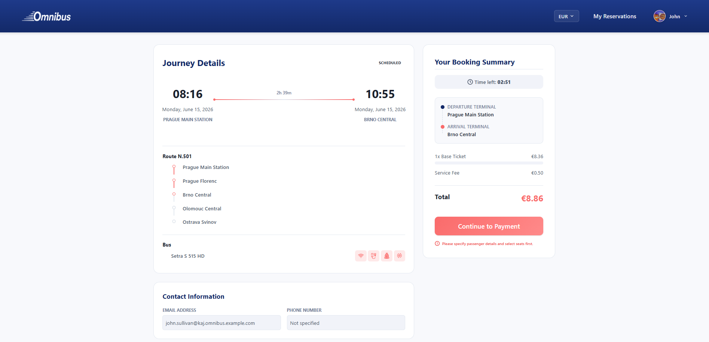
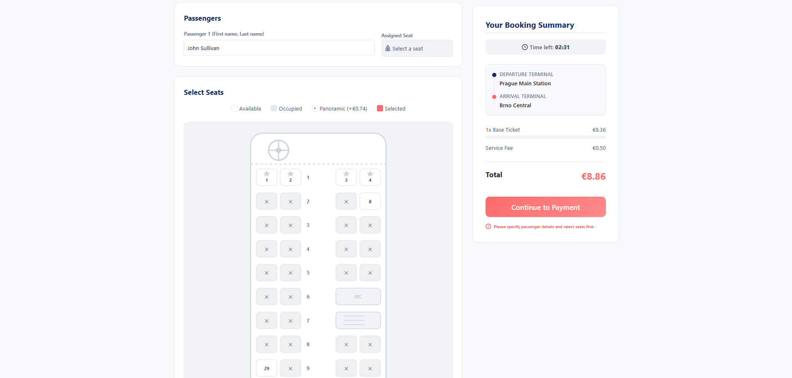
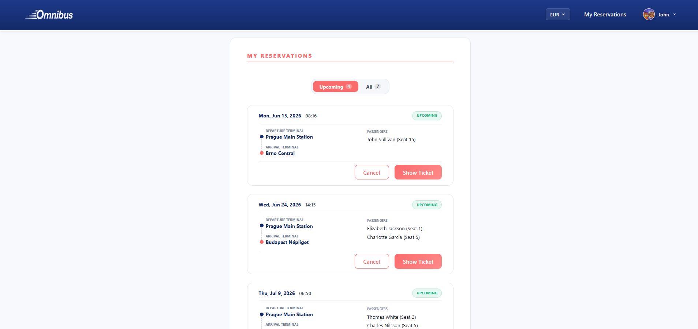
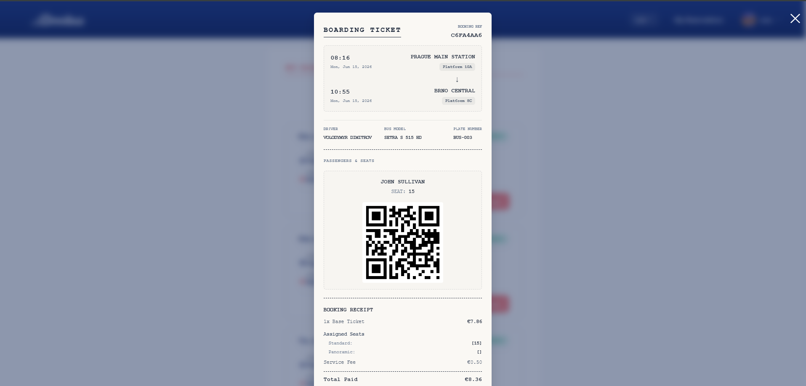
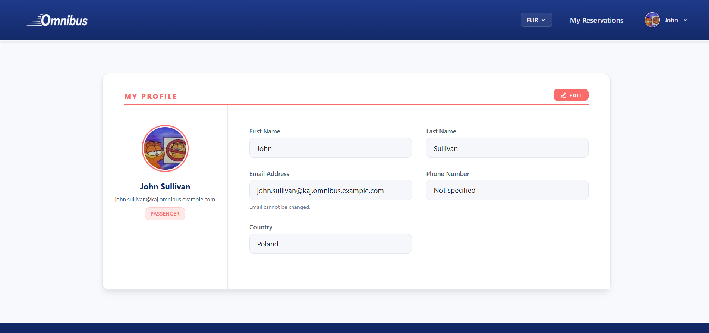

# Omnibus

## Live Demo

The application is deployed and available at:
[omnibus-frontend.vercel.app](https://omnibus-frontend.vercel.app/)

A demo user is available for testing:
- **Email:** `john.sullivan@kaj.omnibus.example.com`
- **Password:** `e[MQhlvU+[9o6Qxv`

---

## Table of Contents
1. [Live Demo](#live-demo)
2. [Motivation](#motivation)
3. [Project Architecture](#project-architecture)
4. [Application Contents](#application-contents)
5. [Project Structure](#project-structure)
6. [Local Development Setup](#local-development-setup)
7. [Evaluation Criteria Compliance](#evaluation-criteria-compliance)
8. [Screenshots](#screenshots)
9. [Author](#author)

---

## Motivation

This project is a bus ticketing platform built around a live, complex search and booking algorithm for trip segments (resolving routes, trips, reservations, and passenger manifests on the backend). The choice of this topic is driven by a personal interest in transport logistics and the non-triviality of implementing a complete, functional booking system.

The backend service was completed during the previous semester's B6B36EAR course. The frontend was developed to serve strictly as a presentation layer. There is no architectural inconsistency: the frontend does not perform business logic or data computations itself, but instead communicates directly with the live Java Spring Boot server and PostgreSQL database, using zero local mock data.

The entire frontend application built within the B0B39KAJ course is located inside the frontend folder.

---

## Project Architecture

The frontend is built as a React Single Page Application (SPA) using TypeScript to enforce strict typing and compile-time safety. 

The application utilizes a modular component design:
- **Routing:** Handled client-side using React Router, allowing smooth page transitions and history management without full page reloads.
- **State Management:** Uses React Context (AuthContext, CurrencyContext) to share authentication states, user tokens, and currency preferences globally across the application.
- **Service Layer (API Client):** Implemented using Axios, configured with request interceptors to automatically append JWT bearer tokens from localStorage for authenticated requests, and response interceptors to handle session expiration (401 errors).
- **Responsive Layout:** Engineered using native CSS Flexbox, Grid systems, and CSS variables, allowing components to dynamically adjust across viewports (mobile, tablet, desktop) without relying on external UI frameworks.

---

## Application Contents

### Registration, Geolocation, and Personalization
During registration, users can upload an avatar (via file input or drag-and-drop) and select a country. Geolocation detection (via browser Geolocation API) resolves the user's country to set system defaults (preferred currency, homepage popular trips, search hints). Profile updates trigger notifications only if the form inputs actually changed. Modifying the preferred currency in the header immediately updates the database and recalculates all prices site-wide.

### Search and Terminal Caching
The search panel autocompletes terminal locations after 2 characters. Suggestions are loaded from a list of terminals cached in localStorage with a 24-hour expiration check (TTL). Search queries support filtering by city, terminal, or country. Search dates are limited to 3 months in advance, and passenger limits are set between 1 and 10. Homepage promo and popular route cards pre-fill the search fields when clicked.

### Parallax Banner and Deferred Media
The homepage parallax banner consists of four custom graphic layers moving along Lissajous curves. The WebGL rendering loop pauses when the browser tab is inactive (Page Visibility API). The fleet walkaround video is loaded deferred (via window load event), using custom play/pause overlay controls.

### Live Database Search and Seat Mapping
Trip searches trigger live database calculations across routes, trips, active passenger lists, and bookings to determine available seats for the segment. The database stores 53 routes with regular schedules for six months and millions of pre-generated segment bookings (25% to 80% occupancy). Surcharges are calculated dynamically based on time of day, international borders, or premium panoramic seats. Unregistered guests must authenticate to book, returning back to active search results afterward.

### Booking, Timeout, and Boarding Passes
The booking screen loads contact details and passenger inputs matching the search count. Seats are selected on a live SVG bus layout map populated from database JSON. Checkout requires selecting all passenger seats and triggers a 15-second simulation timer that redirects to the reservations list (which can be skipped). Going back from payment releases database seat holds. Boarding passes display printable tickets containing timetables, bus/driver parameters, and scan-ready passenger QR codes.

The "My Reservations" page lists active and past bookings. Active confirmed tickets can be cancelled, which instantly releases the seats back into the database. Boarding passes can be opened in a printable layout showing platforms, timetables, bus models, license plates, driver details, and unique passenger QR codes containing booking credentials.

---

## Project Structure

```
src/
├── api/                 # Axios clients and API request handlers
├── assets/              # Static media assets (logos, fleet walkaround MP4 video, images)
├── components/          # Shared components
│   ├── common/          # Button, Card, Input, OfflineAlert, ParallaxBanner, SearchPanel
│   └── layout/          # Header, Footer
├── context/             # React Context stores (AuthContext, CurrencyContext)
├── pages/               # Application pages (HomePage, SearchPage, TripDetailsPage...)
├── utils/               # Helper utilities (geolocation, oopPatterns...)
├── App.tsx              # Main routing and global provider wrapper
├── index.css            # Base stylesheet (custom variables, advanced combinators)
└── main.tsx             # DOM mounting entrypoint
```

---

## Local Development Setup

```bash
# 1. Install dependencies
npm install

# 2. Configure environment variables (.env)
VITE_API_BASE_URL="https://omnibus-frontend-production.up.railway.app/api"

# 3. Launch development server
npm run dev
```

---

## Evaluation Criteria Compliance

### Documentation
This file describes the project's goal, motivation, tech stack, and structural details. Explanatory comments are provided in key files throughout the codebase.

---

### HTML5

- **Valid HTML5:** Vite compiles the application into valid HTML5 code based on the boilerplate template.
- **Semantic Elements:** Appropriate HTML5 tags are used throughout the layouts:
  - [src/App.tsx](src/App.tsx#L95) — `<main>` tag wrapping page contents.
  - [src/components/layout/Footer/Footer.tsx](src/components/layout/Footer/Footer.tsx#L45-L70) — `<footer>`, `<nav>`, and `<section>` tags.
  - [src/pages/HomePage.tsx](src/pages/HomePage.tsx#L285-L330) — `<section>` and `<article>` definitions.
- **Graphics — SVG:**
  - [src/pages/TripDetailsPage.tsx](src/pages/TripDetailsPage.tsx#L731-L891) — Interactive SVG seat selection layout that dynamically updates colors, paths, and selection states.
- **Graphics — Canvas:**
  - [src/components/common/ParallaxBanner/ParallaxBanner.tsx](src/components/common/ParallaxBanner/ParallaxBanner.tsx#L398) — HTML5 `<canvas>` rendering WebGL animated parallax layers.
  - [src/pages/RegisterPage.tsx](src/pages/RegisterPage.tsx#L131-L155) & [src/pages/ProfilePage.tsx](src/pages/ProfilePage.tsx#L164-L187) — A virtual canvas is instantiated programmatically in JS (`document.createElement('canvas')`) to resize and compress uploaded avatar files into JPEG base64 strings.
- **Media — Audio/Video:**
  - [src/pages/HomePage.tsx](src/pages/HomePage.tsx#L297-L306) — Embedded HTML5 `<video>` displaying the Setra bus walkaround.
- **Form Elements & Validation:**
  - [src/pages/RegisterPage.tsx](src/pages/RegisterPage.tsx#L354) — Focus optimization using the `autoFocus` property on the input fields.
  - [src/pages/RegisterPage.tsx](src/pages/RegisterPage.tsx#L340-L385) — Native form validations (`type="email"`, `type="password"`, `required`, `minLength`) integrated with custom real-time JavaScript validation state.

---

### CSS

- **Advanced Selectors:**
  - [src/index.css](src/index.css#L287-L304) — Implements adjacent sibling combinator (`+`), general sibling combinator (`~`), `:focus-within` focus tracking, and combined `:not()` and `:nth-child()` rules.
- **CSS3 2D/3D Transforms & Animations:**
  - [src/components/common/ParallaxBanner/ParallaxBanner.tsx](src/components/common/ParallaxBanner/ParallaxBanner.tsx) — Dynamic 3D translation (`translate3d`) mapping scroll offsets to parallax depth.
  - [src/pages/PaymentPage.css](src/pages/PaymentPage.css#L56-L111) — Success checkmark animation built with custom `@keyframes` (scale, stroke dashoffset, background shadow fill).
- **Media Queries (Responsiveness):**
  - Grid structures, layout wrappers, and typography scaling are fully responsive. 
  - [src/pages/PaymentPage.css](src/pages/PaymentPage.css#L234-L264) — Media queries optimizing container paddings, checkmark sizes, and font ratios specifically for smaller viewport heights (laptops).
- **CSS Nesting:**
  - [src/pages/PaymentPage.css](src/pages/PaymentPage.css#L281-L285) — Uses native nested CSS syntax (nesting `&:hover` directly inside the `.payment-skip-btn` selector).

---

### JavaScript

- **OOP Approach & Prototypical Inheritance:**
  - [src/utils/oopPatterns.ts](src/utils/oopPatterns.ts) — Classical JavaScript prototypical inheritance demo. Defines `BaseTicket` constructor, places methods on its prototype, creates inheriting constructor `BusTicket` via `Object.create(BaseTicket.prototype)`, and exports under a namespace object `OmnibusOOP`.
  - [src/App.tsx](src/App.tsx#L74-L84) — Mounts a test instance of `BusTicket` on startup and outputs verification logs to the developer console.
- **JS Framework Usage:**
  - Built entirely on React 18, utilizing modern hooks (`useState`, `useEffect`, `useContext`, `useRef`, `useMemo`).
- **Advanced JS Web APIs:**
  - **File API:** [src/pages/RegisterPage.tsx](src/pages/RegisterPage.tsx#L127-L162) — uses `FileReader.readAsDataURL()` to preview uploaded images client-side.
  - **Drag & Drop API:** [src/pages/RegisterPage.tsx](src/pages/RegisterPage.tsx#L165-L178) — attaches dragenter, dragover, dragleave, and drop event handlers on the avatar upload zone.
  - **Geolocation API:** [src/utils/geolocation.ts](src/utils/geolocation.ts#L32-L37) — requests permissions and extracts browser coords via `navigator.geolocation.getCurrentPosition`.
  - **LocalStorage:** [src/components/common/SearchPanel/SearchPanel.tsx](src/components/common/SearchPanel/SearchPanel.tsx#L245-L277) — reads and updates terminal data cache in `localStorage` equipped with a 24-hour expiration check.
  - **Page Visibility API:** [src/components/common/ParallaxBanner/ParallaxBanner.tsx](src/components/common/ParallaxBanner/ParallaxBanner.tsx#L317-L356) — listens to `'visibilitychange'` and halts the WebGL render loop when `document.visibilityState !== 'visible'`.
- **History API:**
  - Handled implicitly by React Router.
  - [src/components/layout/Footer/Footer.tsx](src/components/layout/Footer/Footer.tsx#L28) — Programmatic navigation state updates using `window.history.pushState` for page anchor links.
- **Media API:**
  - [src/pages/HomePage.tsx](src/pages/HomePage.tsx#L30-L37) — Controls HTMLMediaElement playback programmatically using custom play/pause overlay click handlers.
- **Offline Application:**
  - [src/components/common/OfflineAlert/OfflineAlert.tsx](src/components/common/OfflineAlert/OfflineAlert.tsx) — Listens to global `'online'` and `'offline'` events to render a blocking overlay, preventing interaction until connection is restored.
- **JS manipulation of SVG:**
  - [src/pages/TripDetailsPage.tsx](src/pages/TripDetailsPage.tsx#L731-L891) — Renders dynamic bus seat states (`circle`, `rect`, etc.) and binds click callbacks dynamically using React.
- **Web Component:**
  - [src/components/layout/Footer/Footer.tsx](src/components/layout/Footer/Footer.tsx#L6-L17) — Declares class `OmnibusFooterInfo` extending `HTMLElement`, defines the custom element via `customElements.define`, and instantiates it dynamically inside a `useEffect` mount hook (lines 35-42) to place in the footer container.

---

## Screenshots

Below are screenshots showcasing the interface and workflows of the Omnibus client application.















---

## Author

**Ivan Shestachenko**
2026, B0B39KAJ @ FEE CTU
